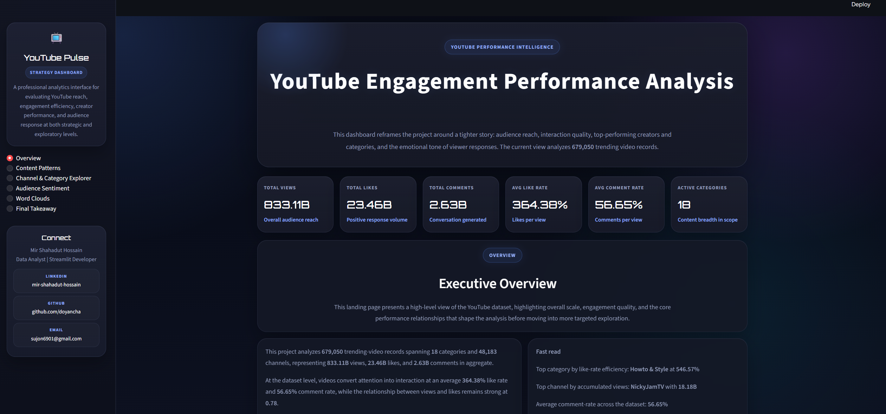
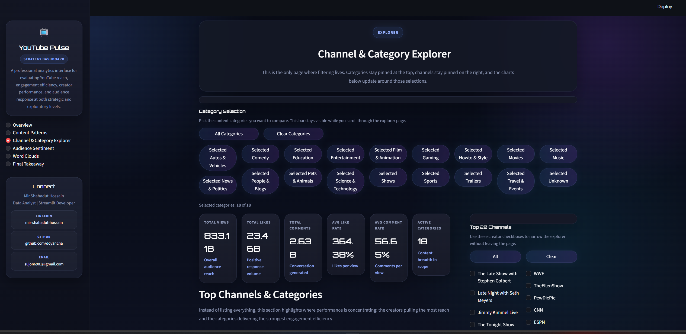
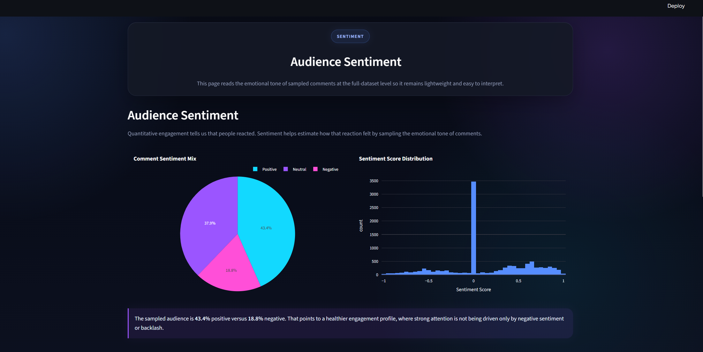
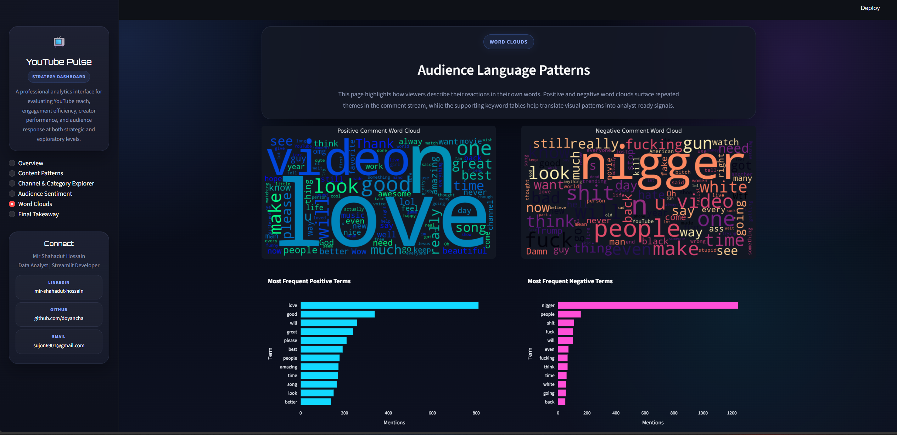
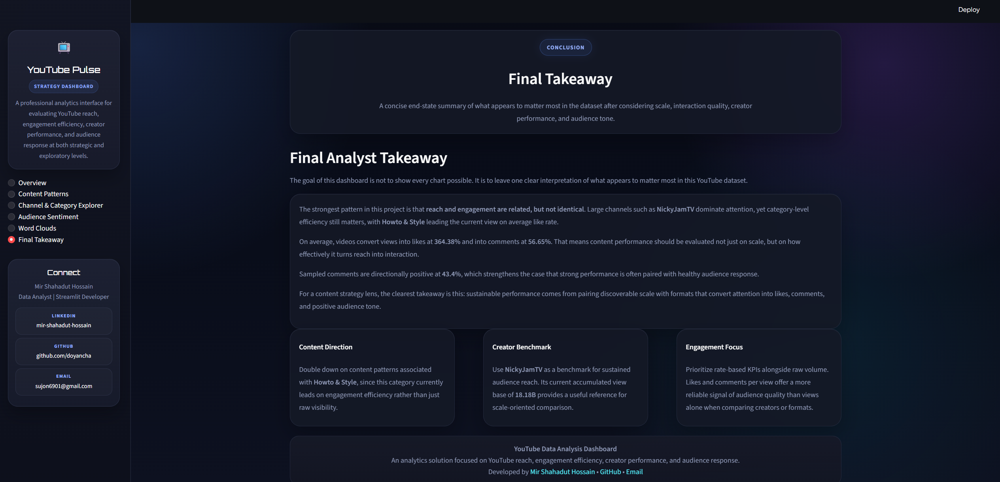
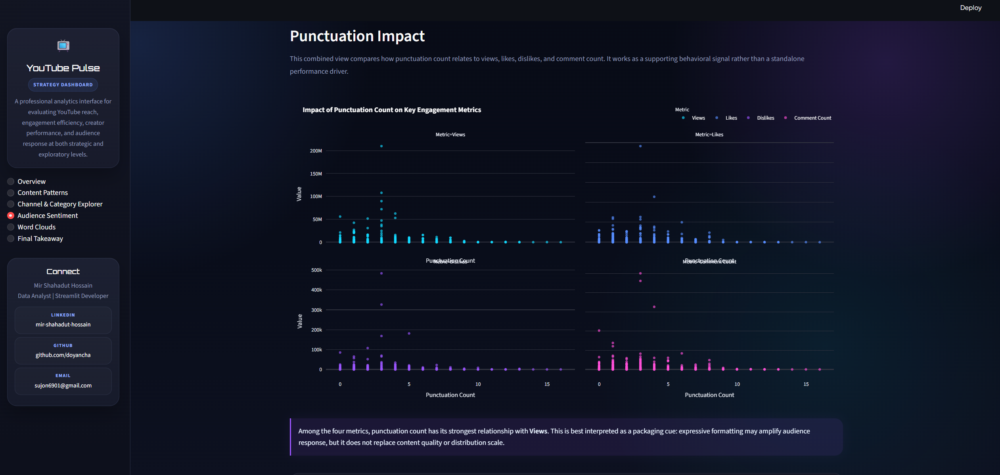

<div align="center">

# YouTube Engagement Performance Analysis

<p>
  <strong>A professional analytics solution for evaluating YouTube reach, engagement efficiency, creator performance, audience sentiment, and content-language patterns.</strong>
</p>

<p>
  <a href="https://www.linkedin.com/in/mir-shahadut-hossain/"></a>
  <a href="https://github.com/doyancha"></a>
  <a href="mailto:sujon6901@gmail.com"></a>
  <a href="https://youtube-data-analysis.streamlit.app/"></a>
</p>

<p>
  
  
  
  
  
</p>

</div>

---

## Executive Summary

This project transforms large-scale YouTube trending and comment data into a polished Streamlit analytics experience focused on one core question:

> **How does YouTube content convert visibility into engagement and audience response?**

The app combines engagement metrics, creator/category comparisons, correlation analysis, sentiment evaluation, and word cloud exploration to provide both strategic and exploratory insight across the YouTube ecosystem.

---

## Repository Description

An interactive YouTube analytics solution built with Streamlit to evaluate content reach, engagement efficiency, creator performance, audience sentiment, and text-based comment patterns using large-scale trending video data.

---

## Skills Demonstrated

- Data cleaning and transformation with Pandas
- Exploratory data analysis and metric engineering
- Engagement-rate analysis and correlation modeling
- Sentiment analysis using comment-level text
- Word cloud and keyword frequency analysis
- Interactive dashboard development with Streamlit
- Data storytelling and business insight communication
- UI/UX design for analytical web applications
- Dashboard performance optimization and filter architecture
- GitHub-ready project documentation and presentation

---

## Project Highlights

<table>
  <tr>
    <td><strong>Trending Video Records</strong><br>679,050</td>
    <td><strong>Categories</strong><br>17</td>
    <td><strong>Channels</strong><br>48,183</td>
    <td><strong>Comment Records</strong><br>691,400</td>
  </tr>
  <tr>
    <td><strong>Total Views</strong><br>833.11B</td>
    <td><strong>Total Likes</strong><br>23.46B</td>
    <td><strong>Total Comments</strong><br>2.63B</td>
    <td><strong>Views vs Likes Correlation</strong><br>0.78</td>
  </tr>
</table>

---

## Business Question

The dashboard is designed to answer the following strategic questions:

- Which content categories convert views into stronger engagement?
- Which creators sustain repeated trending visibility over time?
- How strongly do reach and approval move together?
- What does comment sentiment suggest about audience reception?
- Do content-language cues such as punctuation relate to stronger reaction patterns?

---

## Key Findings

### 1. Reach and approval are strongly related, but not identical

The relationship between **views** and **likes** is strong, with a correlation of **0.78**. This indicates that visibility remains a major driver of public engagement, but some videos convert exposure into likes more efficiently than others.

### 2. Category efficiency matters

The leading category by average **Like Rate** is **Howto & Style**, showing that engagement quality depends not only on creator scale, but also on category fit and content format.

### 3. Trending momentum is not random

The channel with the highest recurring trending presence is **The Late Show with Stephen Colbert**, appearing **710** times in the dataset. This suggests durable creator-level momentum rather than isolated viral spikes.

### 4. Creator scale still dominates raw reach

The top channel by accumulated views is **NickyJamTV**, reinforcing the role of creator brand strength in sustained large-scale visibility.

### 5. Sentiment adds context beyond raw interaction

Comment-based analysis helps distinguish healthy engagement from potentially controversial engagement by identifying the emotional tone of the audience response.

### 6. Packaging signals may influence reaction

Punctuation count is treated as a supporting behavioral signal rather than a primary performance driver. It can indicate expressive formatting patterns that may align with stronger audience reaction.

---

## Dashboard Experience

The Streamlit app is organized into focused pages rather than a single overloaded screen:

### Overview

- Executive KPIs
- Relationship between Views and Likes
- Top channels by trending frequency
- Correlation heatmap
- High-level summary cards

### Content Patterns

- Reach-to-engagement behavior
- Category-wise Like Rate distributions
- Punctuation impact analysis
- Supporting insight callouts

### Channel & Category Explorer

- Sticky category selector
- Sticky top-channel filter panel
- Filtered KPI strip
- Filtered creator/category comparisons
- Filtered reach vs engagement chart

### Audience Sentiment

- Comment sentiment mix
- Sentiment score distribution
- Punctuation impact on views, likes, dislikes, and comments

### Word Clouds

- Positive comment word cloud
- Negative comment word cloud
- Most frequent positive terms
- Most frequent negative terms

### Final Takeaway

- Strategic interpretation of the full analysis
- Recommendation cards for content direction, creator benchmarking, and engagement evaluation

---

## Visual Design Direction

The application is designed as a **dark, neon-glossy analytics interface** with:

- glossy glassmorphism cards
- blue-violet neon accents
- premium KPI panels
- high-contrast typography
- responsive layout structure
- recruiter-friendly storytelling flow

The visual system is intentionally styled to feel more like a modern BI product than a standard notebook export.

---

## Dashboard Preview

The repository includes exported dashboard screenshots in the [`assets`](./assets) folder so visitors can preview the interface before running the app locally.

<table>
  <tr>
    <td></td>
    <td></td>
    <td></td>
  </tr>
  <tr>
    <td></td>
    <td></td>
    <td></td>
  </tr>
</table>

---

## Data Sources Used

### `full_df.csv`

Primary enriched YouTube dataset containing:

- views
- likes
- dislikes
- comment_count
- category_name
- channel_title
- like_rate
- dislike_rate
- comment_count_rate
- punc_count

> **Important:** `full_df.csv` is not committed to the repository because the file is too large for standard GitHub storage. To run the dashboard successfully, place the prepared `full_df.csv` file in the project root beside `app.py`.

### `data/youtube_videos.parquet`

Deployment-ready video dataset generated from `full_df.csv`. It keeps only the columns required by the Streamlit dashboard and stores them in compressed parquet format for faster loading and easier cloud deployment.

### `comments_data.csv`

Comment-level dataset used for:

- sentiment scoring
- positive/negative word clouds
- supporting audience-language analysis

### `data/comments_sentiment.parquet`

Deployment-ready sampled comment dataset with precomputed sentiment labels. This avoids re-scoring comments during every app run and keeps the hosted app lighter.

---

## Technical Stack

- **Python**
- **Streamlit**
- **Pandas**
- **NumPy**
- **Plotly**
- **Matplotlib**
- **Seaborn**
- **WordCloud**
- **NLTK Sentiment Analyzer** with fallback logic when unavailable

---

## Repository Structure

```text
youtube data analysis/
|-- app.py
|-- comments_data.csv
|-- build_deployment_data.py
|-- data/
|   |-- youtube_videos.parquet
|   `-- comments_sentiment.parquet
|-- full_df.csv
`-- youtube_data_analysis.ipynb
```

---

## Deployment Data Workflow

The app now supports a deployment-first data path. When these packaged files exist, `app.py` will automatically use them instead of reading the large raw CSV:

```text
data/
|-- youtube_videos.parquet
`-- comments_sentiment.parquet
```

### Build the packaged deployment files

Run the packaging script from the project root:

```bash
python build_deployment_data.py
```

This script:

- reads your local `full_df.csv`
- keeps only the app-required video columns
- converts the video dataset into a compressed parquet file
- samples comment text from `comments_data.csv`
- precomputes sentiment labels
- saves deployment-ready files into the `data/` folder

Once those files are created, the Streamlit app can run without `full_df.csv` being uploaded to GitHub.

---

## How To Prepare `full_df.csv`

The dashboard expects a preprocessed dataset named `full_df.csv` in the root project directory.

### Option 1. Use your existing prepared file

If you already generated `full_df.csv` locally, place it in:

```text
youtube data analysis/full_df.csv
```

### Option 2. Regenerate it from the notebook

Use [youtube_data_analysis.ipynb](C:\Users\MIR SHAHADUT HOSSAIN\DATA ANALYTICS PROJECTS\YOUTUBE DATA ANALYSIS\enhanced\youtube_data_analysis.ipynb) as the source workflow for rebuilding the enriched dataset. The notebook contains the feature-engineering logic used for:

- category enrichment
- like, dislike, and comment rate calculation
- punctuation count creation
- sentiment-related preparation

After regenerating the enriched dataframe, export it as:

```python
full_df.to_csv("full_df.csv", index=False)
```

### Required file placement

For local regeneration, keep the following source files in the same directory:

```text
youtube data analysis/
|-- app.py
|-- full_df.csv
|-- comments_data.csv
```

If `full_df.csv` is missing, the dashboard can still run as long as the packaged parquet files already exist inside `data/`.

---

## Run Locally

### 1. Install dependencies

```bash
pip install -r requirements.txt
```

### 2. Start the dashboard

```bash
streamlit run app.py
```

---

## Why This Project Matters

This project demonstrates the ability to:

- build a complete analytical storytelling workflow from raw data to interactive application
- design a polished decision-oriented dashboard in Streamlit
- combine quantitative and qualitative signals in a single interface
- turn exploratory notebook logic into structured product-style analytics
- communicate insights in a professional, stakeholder-friendly format

---

## Contact

<div align="center">

**Mir Shahadut Hossain**  
Data Analyst | Streamlit Developer

[LinkedIn](https://www.linkedin.com/in/mir-shahadut-hossain/) | [GitHub](https://github.com/doyancha) | [Email](mailto:sujon6901@gmail.com)

</div>
